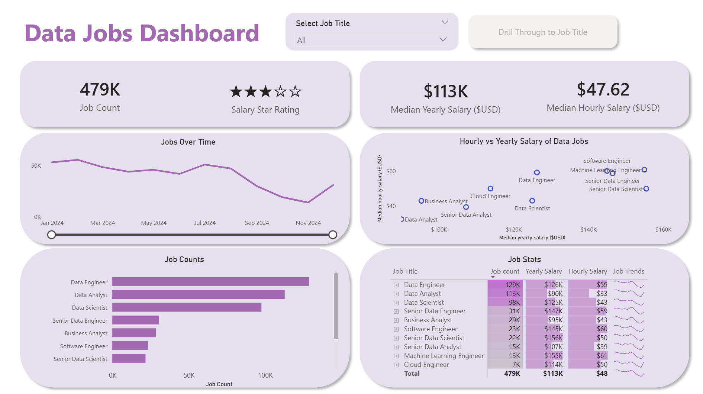
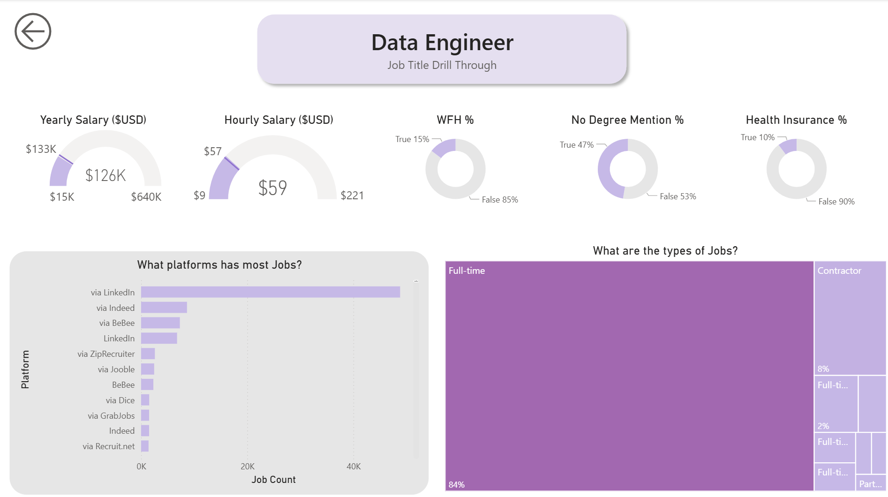
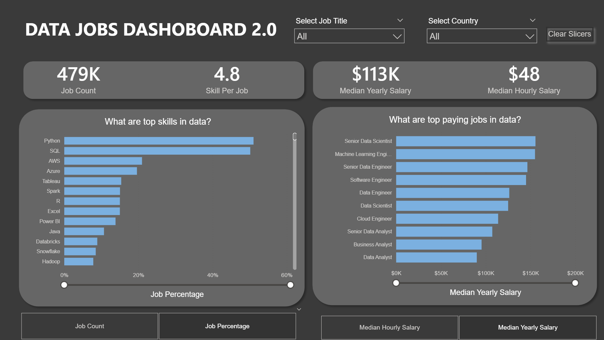

# Power BI Dashboard Portfolio

This repository showcases my journey of learning Power BI through hands-on projects focused on data visualization, business intelligence, and interactive reporting.

The dashboards in this portfolio were built using a real-world Data Jobs dataset and demonstrate my progression from creating interactive reports with standard visualizations to implementing advanced Power BI concepts such as data modeling, DAX, Power Query transformations, and parameter-driven analysis.

## Featured Projects

### Data Jobs Dashboard (Version 1)
An interactive multi-page dashboard designed to explore trends in the data job market, including job demand, salary insights, and job statistics.

####  Dashboard Pages

#### Key Features
* KPI Cards for key metrics
* Interactive slicers for filtering
* Salary trend analysis
* Job count analysis
* Drill-through functionality
* Interactive navigation using Buttons & Bookmarks
* Detailed job statistics table

#### Skills Demonstrated
* Dashboard Design & Layout
* KPI Development
* Data Visualization
* Interactive Reporting
* Slicers & Filtering
* Buttons & Bookmarks
* Drill-Through Navigation
* Business Insight Generation

#### Drill-Through Analysis Page
This page provides a detailed analysis of individual job roles, including:
* Yearly & Hourly Salary Metrics
* Work-From-Home Percentage
* Health Insurance Availability
* Degree Requirement Analysis
* Job Platform Distribution
* Employment Type Breakdown

### Data Jobs Dashboard 2.0 (Version 2)
The second version focuses on improving report design, performance, and analytical capabilities while implementing more advanced Power BI techniques.

#### Dashboard Pages

#### Key Features
* Single-page executive dashboard
* Dynamic metric switching
* Advanced filtering experience
* Parameter-driven visualizations
* Enhanced user experience
* Improved report performance
* Optimized layout and navigation

#### Skills Demonstrated
* Power Query Transformations
* Star Schema Data Modeling
* DAX Measures & Calculations
* `CALCULATE` Function
* Filter Context Management
* Field Parameters
* Numeric Parameters
* Dynamic Visualizations
* Advanced Dashboard Design
* Performance Optimization

## Tools & Technologies
* Power BI Desktop
* Power Query
* DAX (Data Analysis Expressions)
* Star Schema Modeling
* Data Visualization Techniques
* Interactive Report Design

## What I Learned
Through these projects, I gained practical experience in:
* Data cleaning and transformation
* Data modeling and relationships
* Writing DAX measures
* Creating interactive dashboards
* Building user-friendly reports
* Implementing drill-through analysis
* Using parameters for dynamic reporting
* Applying business intelligence concepts to real-world datasets

## Author
**Pallak Anand** 
